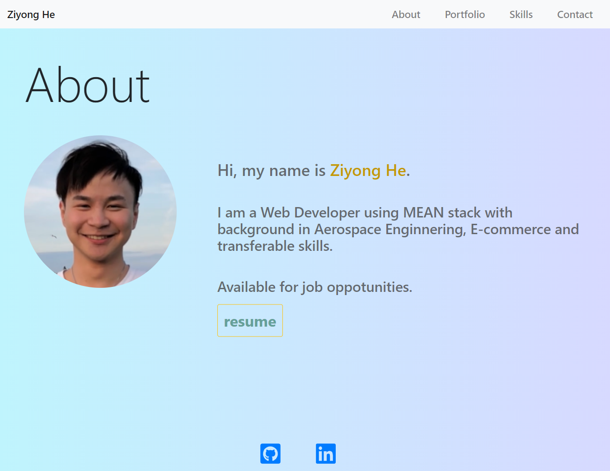

# Portfolio

This portfolio introduces myself, containing my resume, social media links, applied projects that I have done and skills. This web application is mobile-first responsive design, built with React.

:link: [Link to view](http://ziyonghe.github.io/portfolio-react)

## Built with

- [React 17.0](https://reactjs.org/)
- [React Icons 4.1](https://react-icons.github.io/react-icons/)
- [Bootstrap 4.5](https://getbootstrap.com/)
- [GitHub Pages](https://pages.github.com/)

## An Other Version of Portfolio without React 

:link: [Link to view](https://ziyonghe.github.io/Portfolio/index.html)

**Differently Built with**
- animate on scroll
- anime.js
